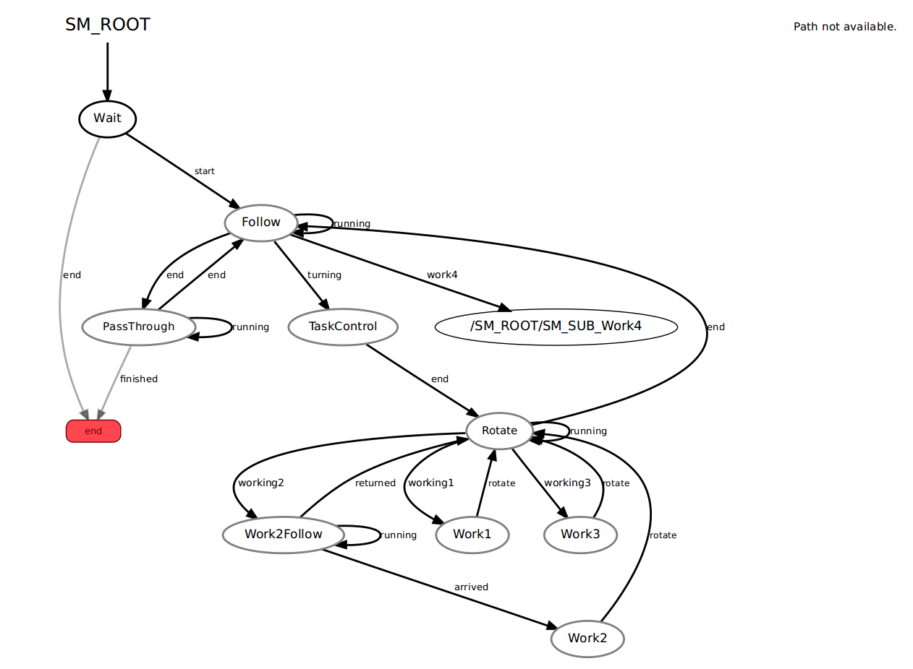

# CMPUT412 FALL 2019 - competition three report
_**Purpose**_

In this competition, the course from Competition 2 is extended to have an area where the robot can navigate off the white line. These areas will be marked by an “off-ramp.” The off-ramp will be a white line branching off from the main course . In the off-ramp area, Location 4, the robot will have the choice of completing several “docking” (i.e. parking) tasks at 55cm x 55cm parking spots. The parking spots will stay static, so the robot can use a map and localization to find them; however, the tasks for any particular parking spot will be randomized. The robot will use 'on ramp' and 'off ramp' to get on or off the track.

Here are the tasks from competition 2.

A race track shaped loop has been with a solid white line marking the path to follow. When travelling in the counterclockwise (CCW) direction, red stop lines indicate where the robot should stop. The robot will be initially placed in full stop at the first stop line. The robot must stay on the line while looping around the track. There are four stop lines, once the robot have done a full loop and reach the start stop line then one run is done.

There are 3 locations for the robot to get extra points. Location 1 is marked by a short red line adjacent to the track, the robot has the chance to earn points by counting the number of objects (one, two, or three) at this location. Location 2 is down a detour, marked by a red line adjacent to the track, again the robot has the chance to earn points by counting the number of objects (one, two, or three) and determining the shape of the green object. Location 3 has three separate red line markers, one for each shape (square, circle, triangle). See Fig 1 below for sketch of the course. The robot will stop at the shape found at Location 2.


Location 1: The first object counting location is located 90 degrees CCW from the line. The robot can count the number of objects without leaving the line. After counting the objects, the robot should display the count using both the LEDs and sound. For example, two objects should be displayed as two LEDs turned on, and two sounds .  Correct object count indicated by LEDs and Sounds

 Location 2: The second object counting location is also located 90 degrees CCW from the line, but the objects are placed at the end of an additional white line (e.g. a path leading to a dead end with the objects). The objects will be shapes (circle, triangle or square), and two will be red and one will be green.

Location 3: The final challenge is to determine the shape of the green object at Location 2 (circle, square, or triangle) and find its matching shape at one of three possible positions at Location 3, on the second half of the course. The shapes at Location 3 will be red. When the robot find the matching object shape it must make a sound to signal the shape has been found. The robot must be facing the matching shape so that judges know which one has been picked.

Location 4: There are eight parking spots taped on the floor. The robot will have to park at the correct spot to receive points. In all cases, the robot must be inside the 55cm x 55cm parking spot. One task will be parking by an ARtag. Another task will be parking at an unlabeled parking spot (still marked with tape, but no ARtag) that will be specified at the start of the run (The robot MUST enter the parking spot number using the logitech controller). The final task will be to park at the Green shape that the robot identified at Location 2 (three spots will be marked by shapes: circle, square, or triangle).
To signal that the robot have parked use the leds and make a sound:
- ARTag - turn led green
- - Shape - turn led orange
-  - Unmarked - turn led red

## _**Pre-requisites**_

-   The project is built with python2.7 on Ubuntu 16.04. Dependencies include ROS kinetic package, smach state machine, and other drivers for the turtle bot sensor. If these are not installed please refer to the official installation page on ROS wiki or official python installation websites.

    -   Kobuki  [http://wiki.ros.org/kobuki/Tutorials/Installation/kinetic](http://wiki.ros.org/kobuki/Tutorials/Installation/kinetic)

    -   Ros-Kinetic  [http://wiki.ros.org/kinetic/Installationu](http://wiki.ros.org/kinetic/Installationu)

    -   Python2  [https://www.python.org/downloads/](https://www.python.org/downloads/)

    -   Smach  [http://wiki.ros.org/smach](http://wiki.ros.org/smach)

This project is built upon
[https://github.com/TianqiCS/CMPUT412-C2]
[https://github.com/TianqiCS/CMPUT412-C1]
Create or navigate the existing catkin workspace and clone our repository.


## _**Execution**_

-   Once you have the package in your workspace, change the package name to c3

    ```
    cd (your path)/catkin_ws
    catkin_make
    source devel/setup.bash

    ```
    now you can launch the program using

    ```
    roslaunch c3 c3_main.launch
    ```

-   arguments and parameters In the launch file c3.launch, the file will launch basic driver for the kuboki robot which is essential for the competition ( minimal.launch and 3dsensor.launch). Next, the file will bring up the basic node for this competition like main file and a usb camera. Finally, there are different sections for in the launch file like example.yaml to give the uvc camera  a basic understanding of view.

-  A map file of the lab is added to the file folder which is used for work4(the new location).   In the c3.launch file, the ar_track_alvar is used to regonize the AR tag. We comment out the view_nevigation package to increase the performance of the robot at runtime.


## _**Process and Strategy**_
-    Our basic strategy includes using pid controller to follow lines, using opencv contour shape detection to detect shapes, using amcl to do localization, using move_base to reach goal point in the location 4.
-    Here are the process details:
-    Firstly, the robot will start with "Wait" state, once the user send unmarked dock point number and start signal, the robot will start follow the white line.
-    As the robot is running, it will find out whether there is a red long line(which means stop) or a red short line(which means detecting the image) and decide if it needs to switch states.
-    For different working tasks, the difference is based on the global variable of "current_work"
-    The state machine will have some kind of work flow like this:
        - 1. Following state will keep the robot following the white line
        - 2. If the robot hit a long red line it will enter the PassThrough state to perform a stop at the long red line
        - 3. If the robot hit a short red line it will enter the TaskControl state to determine how many 90 degrees it should trun and then it goes into Rotate state which controls the robot's rotation based on the yaw value.
        - 4. In the Rotate state, the robot will determine what kind of work it will do based on current value.
        - 5. For the task to count number of white tubes, the robot will detect how many red contours are in the front and indicate the number by Led lights and sound.
        - 6. For the task at location 2, the robot will detect how many red/green contours are in the front and indicate the total number by Led lights and sound, the robot will remember what shape the green contour is in location2.
        - 7. The robot goes 'off ramp' to dock at three locations, one has a the AR tag in the front, one has a contour with same shape in location 2 in the front, one has the index specified in the biginning of the game. The robot will parks in the center of the each square/location.
        - 9. After the robot finishs all parking task it will go to the 'on ramp' point and continue the 'lcoation 3' task, which is find the matching shape at location 2.
        - 10. The robot will go through all the shapes when selecting the shapes. If it found the right one it will make a turn on a light and make a sound.
        - 11. The run is ended when the robot is back to the starting line




#### Notes:
-    We put additional usb camera at the front of the turtle_bot to follow the white line on the ground and the asus camera is used to detect shape of the target.
-    In the function usb_callback, we use the usb camera to detect whether we have a long red line to  short red line. The method is that if it is a long red line there won't be any white in the middle of the track. We think its quicker and easier to identify the difference between two lines.
-    If the object cannot be included into the camera, the robot can back up a little bit to fit the camera view into the right position.
-    Used cv2.pyrMeanShiftFiltering to blur image when detect contours' shapes, but this caused lag.
-    To ensure shape detect result is correct, we detect twice with a few seconds gap to check if results are the same.
-    The code file for work4 is seperate from the main code for further improvement on the coding style.
-    Heavliy used simple task functions like rotation has been seperated from the original file to increase simplicity.
-    Based on the experience we collected from demo4 and demo5, we carefully develop the map using view_nevigation package.
-    After a fairly accurate map is established, we set the way points based on the map. By testing out each waypoint one by one, we want to make sure the run time error genreate by the odem has the minimum effect on the final parking spot.
-    Since the usb camera is stilling running during parking into these red squares, it is likely that the robot takes the parking red square as the functional red lines. New global varibies have set to avoid these conflicts.
-    We used exhaustive search for the parking spot to make sure the robot complete the task and fit into all the squares.
-    Set initial pose when the robot is off ramp instead of the start point of the game.
-    To improve the runtime performance, we choose to not launch rviz, this can be enabled through commenting out lines in launch file.
-    The algorithm to detect shape is from https://www.pyimagesearch.com/2016/02/08/opencv-shape-detection/, we first transfer the image into black and white then find contours in our binary image. Lastly, we draw the contours and the labeled shape on our image
-    The docking process is based on waypoints. We test the waypoints one by one to ensure the the robot will dock on point.

#### Sources
- https://github.com/jackykc/comp5
- https://github.com/cmput412
- https://github.com/bofrim/CMPUT_412
- https://github.com/nwoeanhinnogaehr/412-W19-G5-public
- https://github.com/stwklu/CMPUT_412_code/
- https://www.pyimagesearch.com/2016/02/08/opencv-shape-detection/
- https://github.com/TianqiCS/CMPUT-412-C2
- https://github.com/HumphreyLu6/CMPUT412_demo5_p2
- https://www.cnblogs.com/kuangxionghui/p/8335853.html
